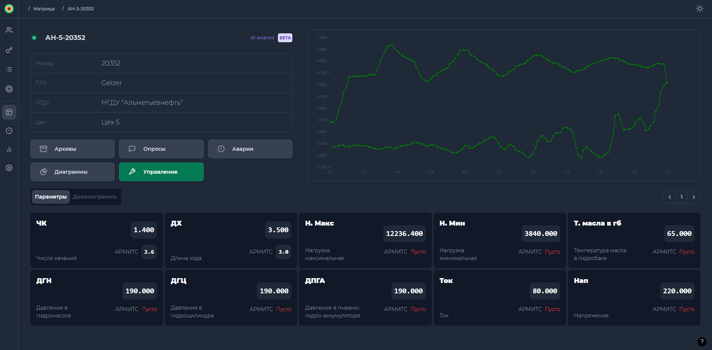
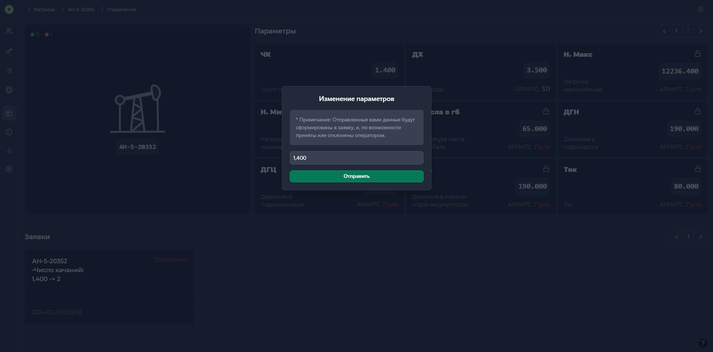

# Светофор
Приложение для управления состоянием скважин, который делает процесс мониторинга простым и эффективным. 
Получайте надежную информацию о доступных вам скважинах в реальном времени и принимайте обоснованные решения на основе актуальных данных. 
Приложение разработано с учетом вашего комфорта и простоты использования для более эффективного управления вашими скважинами.

## Функционал

- [x] **Мониторинг:**

  Просмотр всех данных по доступным вам скважинам, в том числе: аварии, опросы,
  часовые архивы и.т.д. Для удобства просотра есть режимы `карточек` и `таблицы`, с возможностью экспорта в Excel

- [x] **Управление**

  Возможность удалённо вносить изменения в работу скважины по любым доступным для записи параметрам.

- [x] **Ролевое управление доступом**

  Для различных пользователей существуют разные уровни управления доступом. Например,
  рядовой пользователь может просматривать лишь скважины той НГДУ, к которой относится, в то  время как `модератору` доступны все. Также в зависимости от роли пользователя он может подать заявку на **изменение работы скважины**

- [x] **Фильтрация:**

  Скважины можно фильтровать по названию, НГДУ, а также по цехам, принадлежным к НГДУ.
  Аварии, Часовые архивы, Опросы фильтруются по дате и названию. Параметры и динамограммы
  на детальной странице скважины поддерживают **наложение** для мониторинга изменения состояний за разные промежутки времени

- [x] **AI отчёт**

  Генерация отчётов моделью машинного обучения [<b>Динамограф</b>](https://github.com/YaraZan/dinamograph-api)

- [x] **Персонализация**

  Возможность менять цветовую тему приложения 🌙

## Скриншоты

**Страница со всеми доступными скважинами**

- **В верхней части:** Фильтры по НГДУ / связи, пагинация, переключение режима просмотра
- **Центр:** Карточки скважин с отображением основных данных, а также первых трёх основных
параметров слева направо: <code>число качаний</code>, <code>нагрузка макс.</code>, <code>нагрузка мин.</code>

 

**Детальная страница скважины**

- **В верхней части:** Основные данные скважины, навигация по углубленным данным
- **В правой части:** Динамограмма, графическое представление работы скважины, а конкретно ШГН
- **Внизу:** Таблица с записями динамограмм для отображения, пагинация этих записей

 

**Управление скважиной**

- **В правой верхней части:** Список из параметров скважины.
  Каждый параметр отображает данные из двух источников: Контроллера и базы данных АРМИТС.
- **В нижней части:** Список заявок пользователя. Каждая заявка отображает
  *(1) комментарий* и *(2) статус*. Если заявка ещё не была принята или отклонена
  пользователь может **удалить** её.
   
   
  (1) Изменение, которое должно быть внесено в работу скважины
   
  (2) Состояние заявки. В зависимости от действий оператора заявка может быть принята или отклонена

 

**Вывод отчёта Динамографа** - 20.01.2024

- **В правой нижней части:** Отчёт, сформированный моделью машинного обучения
[<b>Динамограф</b>](https://github.com/YaraZan/dinamograph-api). Анализ осуществляется над каждой выбранной
динамограммой. Для достижения максимальной эффективности рекоммендуется выбрать несколько записей

## Производство

Проект нашёл своё применение в компании [ПАО "Татнефть"](https://www.tatneft.ru/)

