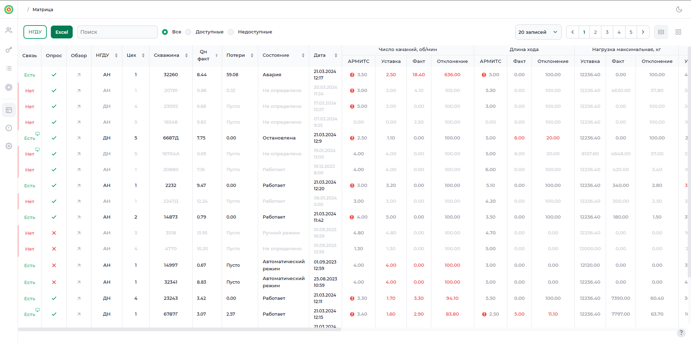
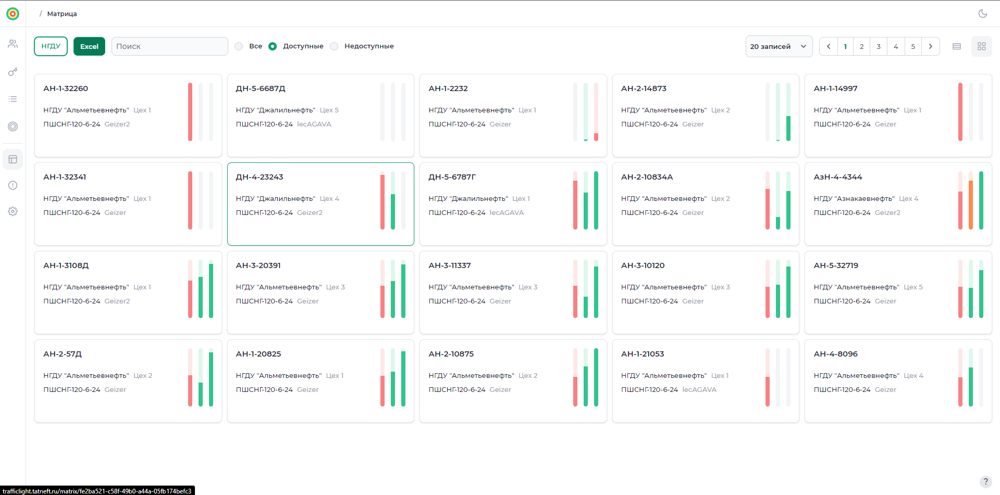
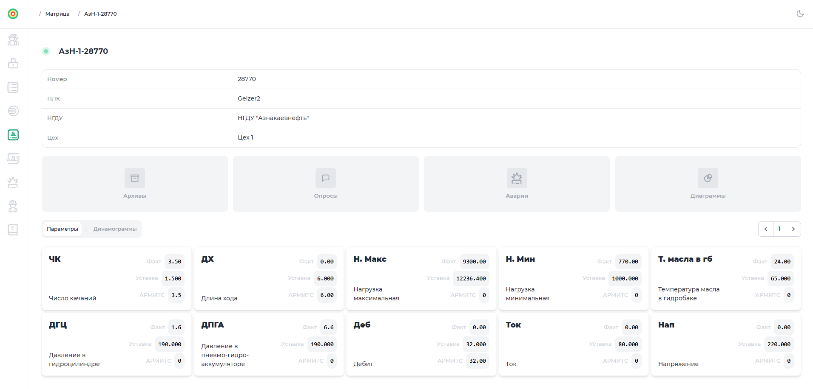
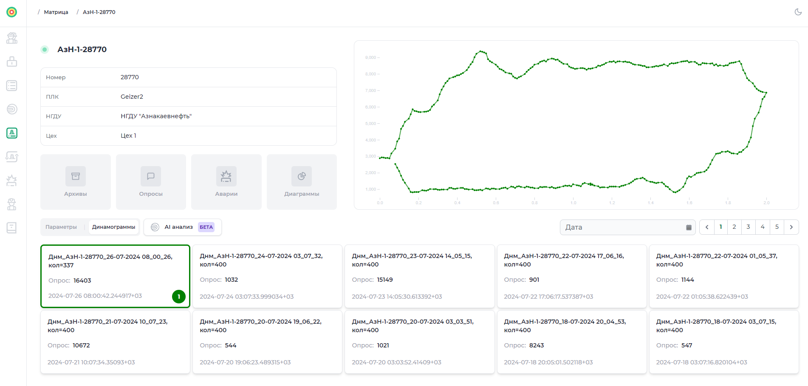
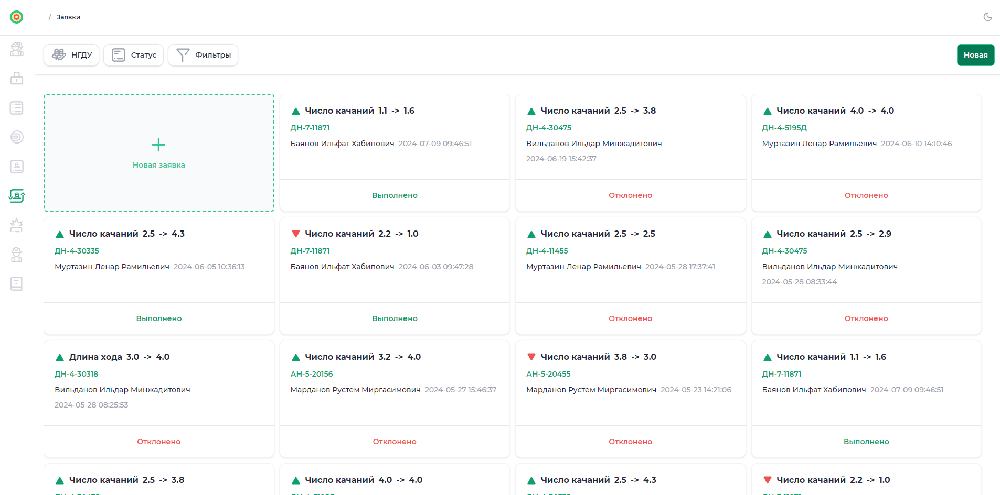
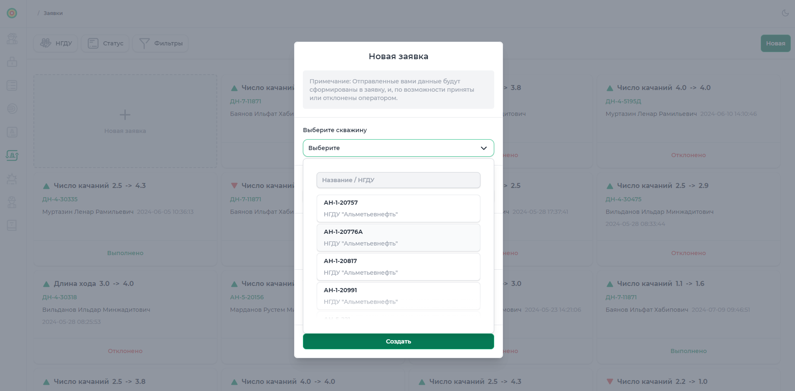
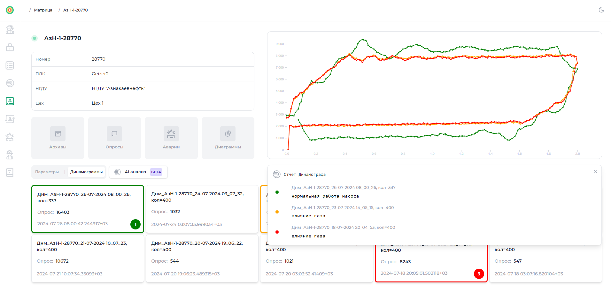

# Светофор
Приложение для управления состоянием скважин, которое делает процесс мониторинга простым и эффективным. Получайте надежную информацию о доступных вам скважинах в реальном времени и принимайте обоснованные решения на основе актуальных данных. Приложение разработано с учетом вашего комфорта и простоты использования для более эффективного управления вашими скважинами.

## Функционал

- [x] **Мониторинг:**

  Просмотр всех данных по доступным вам скважинам, в том числе: аварии, опросы,
  часовые архивы и т.д. Для удобства просмотра доступны режимы `карточек` и `таблицы`, с возможностью экспорта в Excel.

- [x] **Управление**

  Возможность удалённо вносить изменения в работу скважины по любым доступным для записи параметрам.

- [x] **Ролевое управление доступом**

  Для различных пользователей существуют разные уровни управления доступом. Например, рядовой пользователь может просматривать лишь скважины той НГДУ, к которой относится, в то время как модератору доступны все. Также, в зависимости от роли пользователя, он может подать заявку на изменение работы скважины.

- [x] **Фильтрация:**

  Скважины можно фильтровать по названию, НГДУ, а также по цехам, принадлежным к НГДУ. Аварии, часовые архивы, опросы фильтруются по дате и названию. Параметры и динамограммы на детальной странице скважины поддерживают наложение для мониторинга изменений состояний за разные промежутки времени.

- [x] **AI отчёт**

  Генерация отчётов моделью машинного обучения [<b>Динамограф</b>](https://github.com/YaraZan/dinamograph-api).

- [x] **Персонализация**

  Возможность менять цветовую тему приложения 🌙.

## Скриншоты

**Страница со всеми доступными скважинами**

На данной странице можно фильтровать скважины по НГДУ и другим параметрам, а также переключать режим просмотра данных.

 

**Детальная страница скважины**

Здесь отображаются основные данные скважины, динамограмма и таблица с записями динамограмм.

 

**Управление скважиной через заявки**

На этой странице можно просматривать параметры скважины и управлять заявками на изменения. Каждая заявка содержит комментарий и статус, и может быть удалена, если ещё не принята или отклонена.

 

**Вывод отчёта Динамографа**

Отчёт, сформированный моделью машинного обучения [<b>Динамограф</b>](https://github.com/YaraZan/dinamograph-api), анализирует выбранные динамограммы. Рекомендуется выбрать несколько записей для максимальной эффективности.

 

## Производство

Проект нашёл своё применение в компании [ПАО "Татнефть"](https://www.tatneft.ru/)
