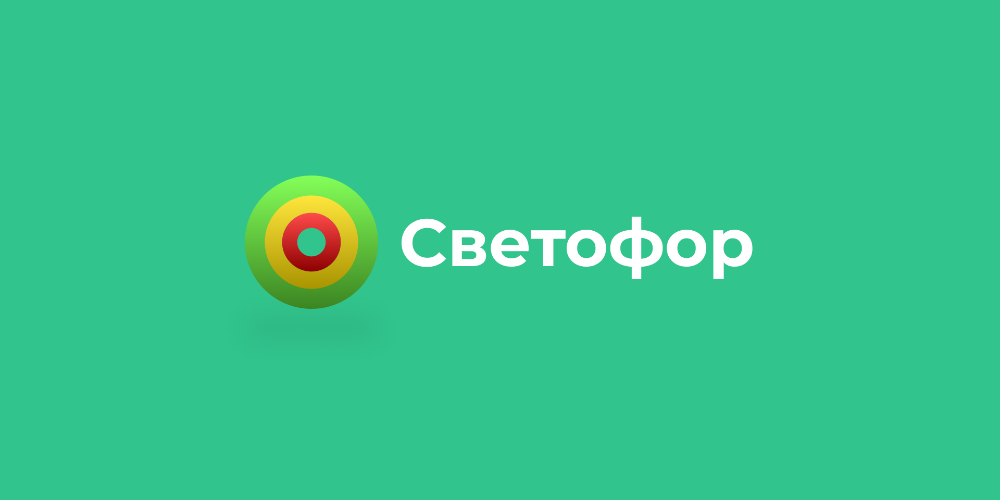
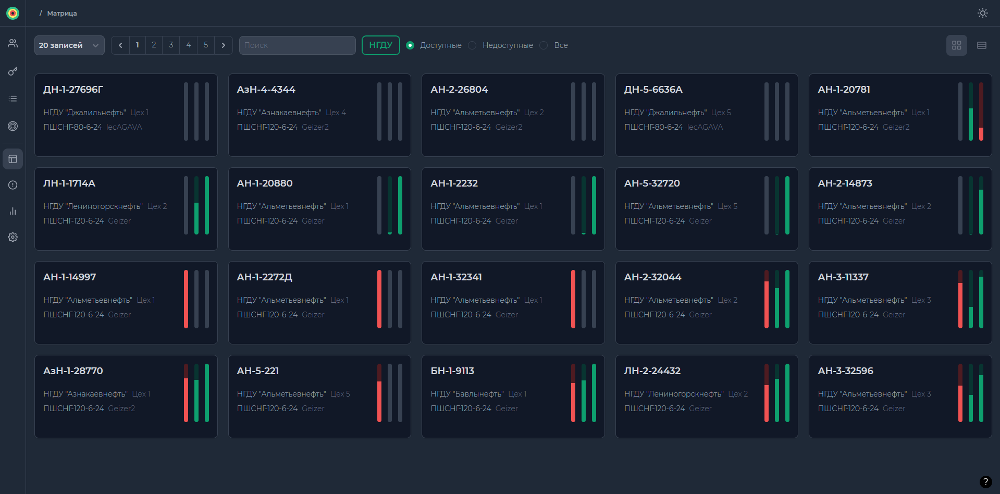
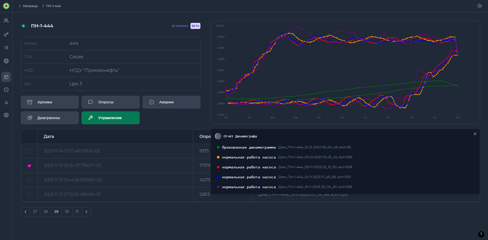

# Светофор
Веб-приложение для мониторинга и управления состоянием скважин

**Автор:** [Ярослав Потёмкин](https://github.com/YaraZan)

## Примеры функционала
- **Мониторинг:**

  Просмотр всех данных по доступным вам скважинам, в том числе: аварии, опросы,
  часовые архивы и.т.д. Для удобства просотра есть режимы `карточек` и `таблицы`, с возможностью экспорта в Excel

- **Ролевое управление доступом**

  Для различных пользователей существуют разные уровни управления доступом. Например,
  рядовой пользователь может просматривать лишь скважины той НГДУ, к которой относится, в то  время как `модератору` доступны все. Также в зависимости от роли пользователя он может подать заявку на **изменение работы скважины**

- **Фильтрация:**

  Скважины можно фильтровать по названию, НГДУ, а также по цехам, принадлежным к НГДУ.
  Аварии, Часовые архивы, Опросы фильтруются по дате и названию. Параметры и динамограммы
  на детальной странице скважины поддерживают **наложение** для мониторинга изменения состояний за разные промежутки времени

- **AI отчёт** Тестируется

  Генерация отчётов моделью машинного обучения [<b>Динамограф</b>](https://github.com/YaraZan/dinamograph-api)

- **Персонализация**

  Возможность менять цветовую тему приложения 🌙

## Скриншоты

**Страница со всеми доступными скважинами**

- **В верхней части:** Фильтры по НГДУ / связи, пагинация, переключение режима просмотра
- **Центр:** Карточки скважин с отображением основных данных, а также первых трёх основных
параметров слева направо: <code>число качаний</code>, <code>нагрузка макс.</code>, <code>нагрузка мин.</code>
 

**Детальная страница скважины**

- **В верхней части:** Основные данные скважины, навигация по углубленным данным
- **В правой части:** Динамограмма, графическое представление работы скважины, а конкретно ШГН
- **Внизу:** Таблица с записями динамограмм для отображения, пагинация этих записей
 

**Вывод отчёта Динамографа**

- **В правой нижней части:** Отчёт, сформированный моделью машинного обучения
[<b>Динамограф</b>](https://github.com/YaraZan/dinamograph-api). Анализ осуществляется над каждой выбранной
динамограммой. Для достижения максимальной эффективности рекоммендуется выбрать несколько записей

## Стек технологий
**Client:** Vue, Vite, TailwindCSS

**Server:** Laravel

## Производство

Проект нашёл своё применение в следующих компаниях:

- [ПАО "Татнефть"](https://www.tatneft.ru/)

